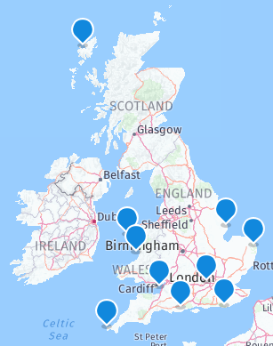
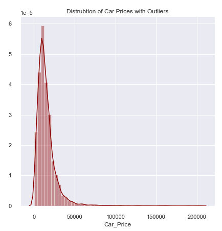
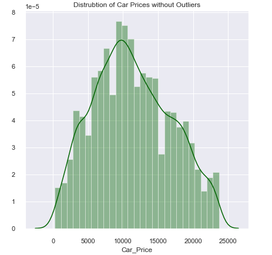
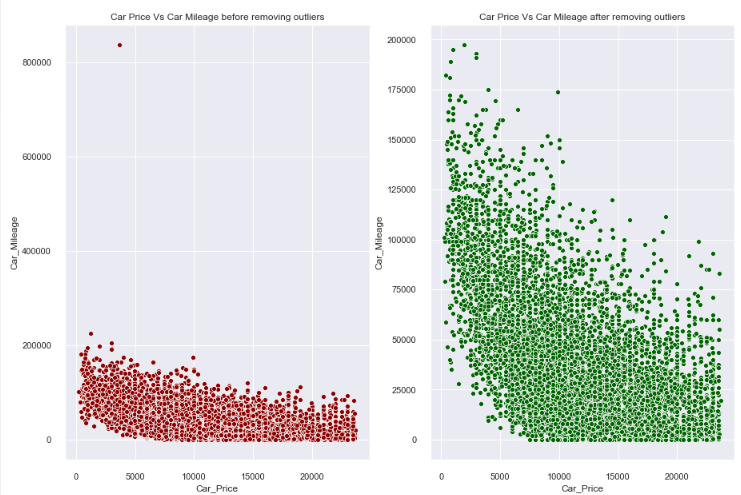
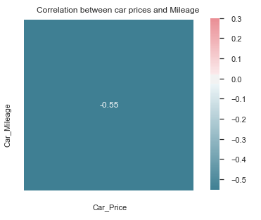
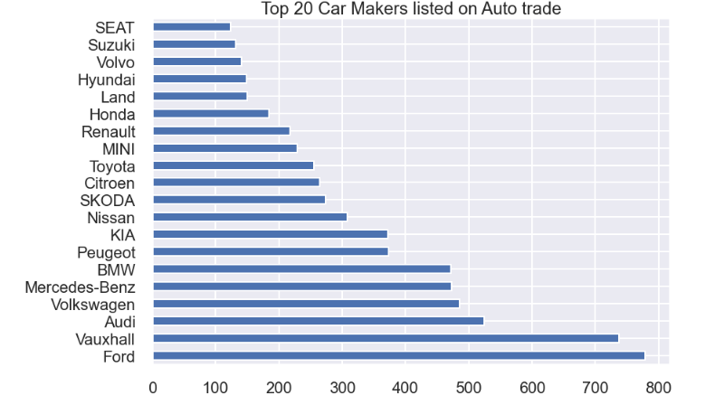
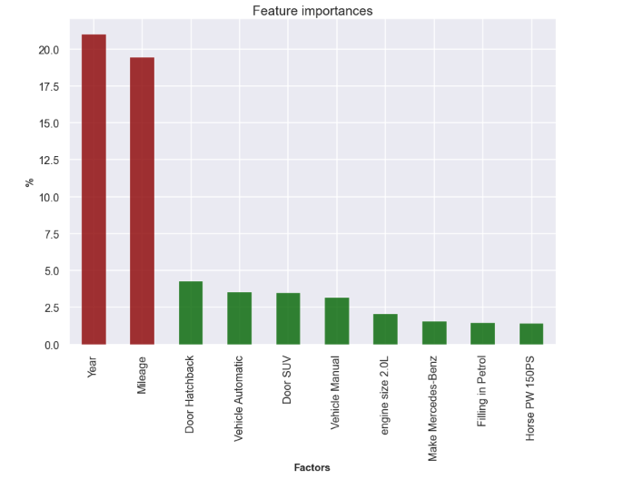

# Car Price Estimator: Data Science Project Overview

- Created a tool that estimates car prices (MAE ~ £400) to help car owners/buyers to negotiate the deal. 
- Scraped over 8000 car listing from auto trade using python and beautifulsoup
- Optimized Linear, Lasso, Decision Tree and Random Forest Regressors using GridsearchCV to reach the best model.

# Code and Resources Used

**Python Version**: 3.7

**Packages**: pandas, numpy, sklearn, matplotlib, seaborn,json, pickle

**Scraper Resource**: https://stackoverflow.com/questions/60012952/how-to-code-a-for-loop-in-python-for-a-web-scraper

# Web Scraping
Auto trade only allows to scraper top 1000 listing per search. To extract large amount of data, I created a list of postcode around the UK and used for loop to scraper car data around postcodes and pages.

1. I decided to pick 10 postcodes around the UK to extract large amount of data as 1000 listing per Search and each page has roughly 10 car listings

2. I'm extracting information like car title, prices, mileage, engine size ,gearbox and etc.

I scraped over 8000 Car listing from autotrade.com. With each listing, we got the following:

- Title
- Price
- Mileage
- Make
- BHP
- Engine Size
- Type of Vehicle
- Type of Gearbox
- Type of Fuel (Petrol,Diesel or Hybrid)
- Year 

# Data Cleaning
After downloading the data, I needed to clean it up so that it was usable for our model. I made the following changes and created the following variables:

# EDA

 

**Insight**

Average Car Prices are around £12,000 

75% of cars has mileage less than 56,000 miles.

30,000 is the average car mileage

Negative Correlation make sense as car mileage goes up the car prices comes down.

Hybrid and Diesel cars are clearly more expensive than petrol cars.

On Average Hybrid Cars are £2,000 more expensive than petrol cars. The reason could be Hybrid cars were introduced in early 2000s and its still growing in its popularity as environmental crisis are widely discussed.

On Average Automatic cars are £1,500 more expensive than Manual.

Ford is the most listed car on AutoTrade and also it is most common car sold in UK.

It is interesting to see most cars listed on Auto trades shows that 2.0L producing more Automatic Cars compare to any other engine size which is mainly dominated by manual cars.

# Model 
First, I transformed the categorical variables into dummy variables. I also split the data into train and tests sets with a test size of 25%.

I tried four different models and evaluated them using Mean Absolute Error.  I chose MAE because it is relatively easy to interpret and outliers aren’t particularly bad in for this type of model.

I tried four different models:

Lasso  – Baseline for the model

Decision Tree and kneighborsclassifier 

Random Forest – Again, with the sparsity associated with the data, I thought that this would be a good fit.

# Evalution

The Random Forest model far outperformed the other approaches on the test and validation sets.

Random Forest : MAE = 479

Decision Tree MAE = 1760

Lasso Regression: MAE = 1609
